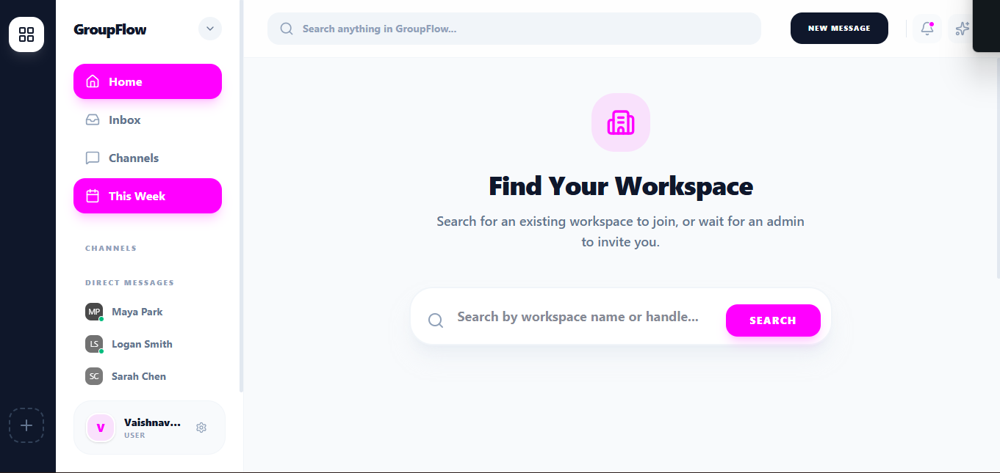
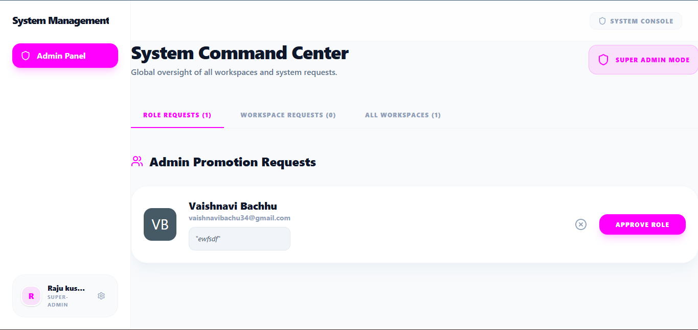
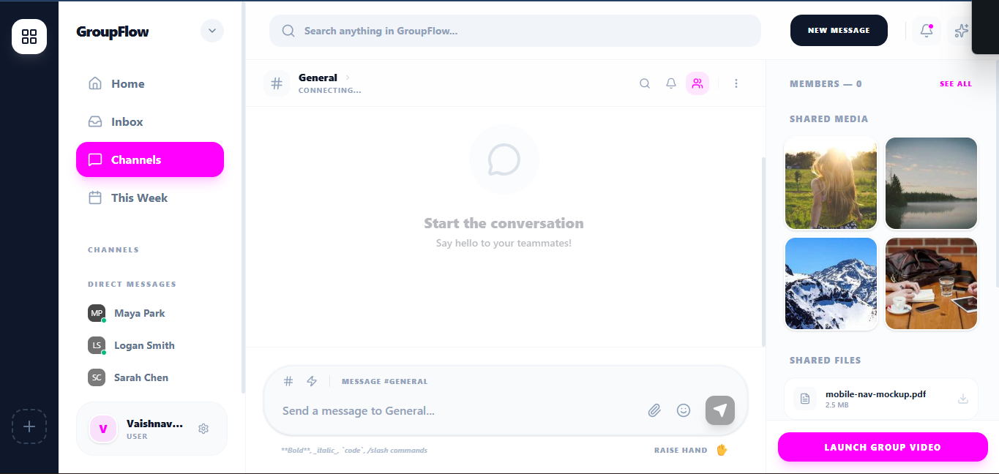

# Group Discussion Platform

A real-time, scalable group discussion and workspace management platform. Built with the MERN stack (MongoDB, Express, React, Node.js), Socket.IO for real-time communication, and Redis for scalable WebSocket events.

## Screenshots





## 🚀 Features

- **Real-time Communication**: Instant messaging and live updates powered by Socket.IO.
- **Workspace Management**: Users can discover, search for, and request to join available workspaces.
- **Advanced Room System**: Organize discussions into specific rooms within workspaces.
- **Secure Authentication**: JWT-based authentication with secure password hashing (bcrypt).
- **Markdown Support**: Rich text formatting in messages using Markdown and GFM (GitHub Flavored Markdown).
- **Scalable Architecture**: Redis adapter integrated for multi-node Socket.IO deployments.
- **Modern UI/UX**: Built with React, Tailwind CSS 4, and Lucide Icons for a clean, responsive, and beautiful interface.
- **State Management**: Efficient global state management using Zustand.

## 🛠️ Tech Stack

### Frontend
- **Framework**: React 18 with Vite
- **Styling**: Tailwind CSS v4
- **State Management**: Zustand
- **Routing**: React Router DOM v7
- **Icons**: Lucide React
- **Real-time**: Socket.IO Client
- **Markdown**: React Markdown, Remark GFM

### Backend
- **Runtime**: Node.js
- **Framework**: Express.js
- **Database**: MongoDB with Mongoose
- **Real-time**: Socket.IO
- **Scaling**: Redis (Socket.IO Redis Adapter)
- **Authentication**: JSON Web Tokens (JWT), bcryptjs
- **Security**: Helmet, CORS, Express Validator

## 📋 Prerequisites

Before you begin, ensure you have the following installed:
- [Node.js](https://nodejs.org/) (v16 or higher)
- [MongoDB](https://www.mongodb.com/) (Local or Atlas)
- [Redis](https://redis.io/) (for Socket.IO scaling)

## ⚙️ Installation & Setup

1. **Clone the repository**
   ```bash
   git clone <your-repository-url>
   cd group-discussion-tool
   ```

2. **Backend Setup**
   ```bash
   cd server
   npm install
   ```
   *Create a `.env` file in the `server` directory and add the necessary environment variables (e.g., `PORT`, `MONGO_URI`, `JWT_SECRET`, `REDIS_URL`).*

3. **Frontend Setup**
   ```bash
   cd ../client
   npm install
   ```
   *Create a `.env` file in the `client` directory for your frontend environment variables (e.g., `VITE_API_URL` pointing to your backend).*

## 🚀 Running the Application

You will need two separate terminal windows/tabs to run the frontend and backend concurrently.

**Terminal 1: Start the Backend (Development Mode)**
```bash
cd server
npm run dev
```

**Terminal 2: Start the Frontend (Development Mode)**
```bash
cd client
npm run dev
```

The application should now be running. The frontend typically runs on `http://localhost:5173` and the backend on the port specified in your `.env` file (e.g., `http://localhost:5000`).

## 📁 Project Structure

```text
group-discussion-tool/
├── client/                # React Frontend
│   ├── src/
│   │   ├── features/      # Feature-based module grouping (e.g., home, workspaces)
│   │   └── ...
│   ├── package.json
│   └── vite.config.js
└── server/                # Node.js/Express Backend
    ├── index.js           # Entry point
    ├── models/            # Mongoose schemas
    ├── routes/            # Express routes
    ├── controllers/       # Route handlers
    ├── package.json
    └── ...
```

## 🤝 Contributing

1. Fork the project
2. Create your feature branch (`git checkout -b feature/AmazingFeature`)
3. Commit your changes (`git commit -m 'Add some AmazingFeature'`)
4. Push to the branch (`git push origin feature/AmazingFeature`)
5. Open a Pull Request

## 📄 License

This project is licensed under the ISC License.
